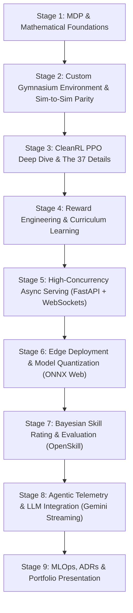

# 🎓 Slyth-AI: The Complete Engineering & Theoretical Learning Roadmap

> **How to use this guide**: This document is designed to guide you through building **Slyth-AI** from scratch while mastering the underlying science. It does not spoon-feed code; instead, it provides:
> 1. **Core Conceptual Foundations**: What you are building and the mathematics behind it.
> 2. **Curated High-Quality Learning Resources**: Direct links to foundational textbooks, seminal papers, official documentation, and line-by-line video breakdowns.
> 3. **Parameter Deep-Dive & Justifications**: Why specific constants and architectural parameters exist and what happens when they are tweaked.
> 4. **The "Interview Defense" Checklist**: Concrete technical questions you must be able to answer before proceeding to the next stage.

---

## 🗺️ Master Curriculum Overview



---

## Stage 1: Markov Decision Processes & Policy Gradient Foundations

### 1. What You Need to Master
Before writing a single line of RL code, you must understand the mathematical framework of Reinforcement Learning:
- **Markov Decision Process (MDP)**: Formal definition as a 5-tuple $(S, A, P, R, \gamma)$.
- **The Markov Property**: Why the future is conditionally independent of the past given the present state: $P(S_{t+1} \mid S_t, A_t, \dots, S_0, A_0) = P(S_{t+1} \mid S_t, A_t)$.
- **Value Functions & Bellman Equations**:
  - State-value function: $V^\pi(s) = \mathbb{E}_\pi [G_t \mid S_t = s]$
  - Action-value function: $Q^\pi(s, a) = \mathbb{E}_\pi [G_t \mid S_t = s, A_t = a]$
  - Advantage function: $A^\pi(s, a) = Q^\pi(s, a) - V^\pi(s)$
- **The Policy Gradient Theorem**: How we can take the gradient of an expected return with respect to policy parameters $\theta$ without knowing environment transition dynamics:
  $$\nabla_\theta J(\theta) = \mathbb{E}_{\tau \sim \pi_\theta} \left[ \sum_{t=0}^T \nabla_\theta \log \pi_\theta(a_t \mid s_t) \cdot A^{\pi_\theta}(s_t, a_t) \right]$$

### 2. Curated Primary Resources
- 📖 **The Bible of RL**: [Reinforcement Learning: An Introduction (2nd Ed.)](http://incompleteideas.net/book/the-book-2nd.html) by Richard S. Sutton & Andrew G. Barto.
  - *Must-read chapters*: Chapter 3 (Finite MDPs), Chapter 4 (Dynamic Programming), Chapter 13 (Policy Gradient Methods).
- 🎥 **The Classic Lecture Series**: [David Silver's RL Course (UCL / DeepMind)](https://www.davidsilver.uk/teaching/)
  - *Must-watch*: Lecture 1 (Introduction), Lecture 2 (MDPs), Lecture 7 (Policy Gradient Methods).
- 💻 **Practical Theory Bridge**: [OpenAI Spinning Up in Deep RL: Key Concepts](https://spinningup.openai.com/en/latest/spinningup/rl_intro.html)
  - *Why it's essential*: Translates math directly into pseudocode and intuitive explanations.

### 3. Key Decision: Policy Gradient vs. Q-Learning (DQN)
- **Why Policy Gradients (PPO/Actor-Critic) for Slyth?**
  - DQN works natively only on **discrete, low-dimensional action spaces** (e.g., UP, DOWN, LEFT, RIGHT).
  - Snake navigation in Slyth requires **continuous steering** (smooth angular heading in radians $[-\pi, \pi]$) and an analog boost trigger. Discretizing continuous angles into 8 or 16 bins introduces discretization error and action-space explosion.
  - Continuous policy methods output parameters of a probability distribution (mean $\mu$ and standard deviation $\sigma$ of a Gaussian $\mathcal{N}(\mu, \sigma)$), enabling fluid, natural trajectories.

### 4. 🛡️ Interview Defense Checklist
- [ ] *Can you derive why the baseline in policy gradients reduces variance without introducing bias?*
- [ ] *What is the physical interpretation of the Advantage function $A(s, a)$, and why is it better than raw cumulative return $G_t$?*
- [ ] *Why does standard Q-learning fail or struggle with continuous control tasks?*

---

## Stage 2: Gymnasium Environment Engineering & Sim-to-Sim Physics Parity

### 1. What You Need to Master
- **Gymnasium API Specification**: Standardizing `__init__`, `reset(seed, options) -> (obs, info)`, and `step(action) -> (obs, reward, terminated, truncated, info)`.
- **Observation Space Design**: Creating ego-centric, translation-invariant, rotation-invariant feature representations.
- **Continuous Action Mapping**: Mapping normalized network outputs $[-1.0, 1.0]$ to physical angular velocities and boost states.
- **The "Sim-to-Sim" Gap**: How subtle differences in floating-point physics, delta timing ($dt$), and sub-step integration cause trained models to fail when deployed across language boundaries (Python $\rightarrow$ JavaScript).
- **Domain Randomization (DR)**: Adding intentional parameter noise during training so the policy treats browser frame-rate jitter as known variance.

### 2. Curated Primary Resources
- 📚 **Official Specification**: [Farama Gymnasium: Make Your Own Custom Environment](https://gymnasium.farama.org/introduction/create_custom_env/)
  - *Focus*: Environment life cycle, action spaces (`spaces.Box`), and observation spaces.
- 📚 **Vectorized Environments & Wrappers**: [Gymnasium Vector Environments](https://gymnasium.farama.org/api/vector/)
  - *Focus*: `SyncVectorEnv`, `TransformObservation`, and `NormalizeObservation`.
- 📄 **Foundational Paper on Sim-to-Real / Domain Randomization**: [Domain Randomization for Transferring Deep Neural Networks](https://arxiv.org/abs/1703.06907) (Tobin et al., OpenAI).
  - *Focus*: Explains why randomizing physical constants produces policies robust to deployment discrepancies.
- 🎮 **Spatial Grid Math**: [2D Spatial Hash Grid Tutorial](https://conkerjo.wordpress.com/2009/06/13/spatial-hashing-implementation-for-fast-2d-collisions/)
  - *Focus*: Understanding $O(1)$ spatial queries vs $O(N^2)$ pairwise distance checks.

### 3. Parameter Deep-Dive & Mathematical Choices
- **Observation Dimension: Exactly 32 Floats**
  - *16 Sensory Feeler Rays*: 4 cardinal sectors $\times$ 4 collision classes (Boundary, Food Density, Enemy Body, Enemy Head). Normalized by $\text{feelerLength} = 220\text{px}$.
  - *Target Vectors*: Normalized angle $\Delta\theta / \pi \in [-1, 1]$ and distance $\min(1.0, d / d_{\max}) \in [0, 1]$.
  - *Relative Mass Ratios*: Clamped using $\tanh(\text{mass}_{\text{enemy}} / \text{mass}_{\text{self}} - 1.0)$ to prevent outliers from exploding gradients when facing giant titan snakes.
- **Sub-step Integration**:
  - In `snake.js`, when a snake travels $\text{dist} = \text{speed} \times dt$, it takes sub-steps spaced by $2.5\text{px}$ to record segment points smoothly.
  - In Python `slyth_env.py`, you must replicate this exact numerical loop, otherwise turning circles will deviate between Python and JavaScript!
- **Domain Randomization Bounds**:
  - Inject $\mathcal{U}(-0.05, 0.05)$ ($\pm 5\%$) on base speed and $\mathcal{U}(-0.08, 0.08)$ ($\pm 8\%$) on turn rate per episode.

### 4. 🛡️ Interview Defense Checklist
- [ ] *Why is ego-centric coordinate transformation (angles relative to the snake's current heading) superior to absolute Cartesian world coordinates $(x, y)$?*
- [ ] *What is the difference between `terminated` (game condition, e.g. collision) and `truncated` (time limit reached), and why does mixing them up corrupt value bootstrap estimation in GAE?*
- [ ] *How did you prove that the Python environment and JavaScript game engine have kinematic parity?*

---

## Stage 3: Deep PPO Implementation — The "37 Implementation Details"

### 1. What You Need to Master
Proximal Policy Optimization (PPO) is the industry standard continuous control algorithm. However, standard textbook equations do not match production implementations. Modern PPO depends on specific implementation details documented by CleanRL and ICLR research:
- **Clipped Surrogate Objective**:
  $$L^{\text{CLIP}}(\theta) = \hat{\mathbb{E}}_t \left[ \min\left( r_t(\theta)\hat{A}_t, \, \text{clip}(r_t(\theta), 1-\varepsilon, 1+\varepsilon)\hat{A}_t \right) \right]$$
  where $r_t(\theta) = \frac{\pi_\theta(a_t \mid s_t)}{\pi_{\theta_{\text{old}}}(a_t \mid s_t)}$.
- **Generalized Advantage Estimation (GAE)**:
  $$\hat{A}_t^{\text{GAE}(\gamma, \lambda)} = \sum_{l=0}^\infty (\gamma \lambda)^l \delta_{t+l}^V$$
  where $\delta_t^V = r_t + \gamma V(s_{t+1}) - V(s_t)$.
- **Orthogonal Weight Initialization**: Preserving gradient norm across layer transitions.
- **State-Independent Log-Standard Deviation**: Why $\log \sigma$ is parameterized as a free `nn.Parameter` rather than an output of the feature extractor.

### 2. Curated Primary Resources
- 📄 **The Bible of PPO Details**: [The 37 Implementation Details of Proximal Policy Optimization (ICLR Blog Track 2022)](https://iclr-blog-track.github.io/2022/03/25/ppo-implementation-details/) by Shengyi Huang et al.
  - *Must-read*: Covers the exact differences between paper equations and working code.
- 🎥 **Video Walkthrough by CleanRL Author**: [The 37 Implementation Details of PPO (YouTube)](https://www.youtube.com/watch?v=MEt6rrxH8W4)
  - *Watch this*: Author Costa Huang walks through each detail with ablation charts.
- 💻 **Reference Implementation**: [CleanRL `ppo_continuous_action.py`](https://github.com/vwxyzjn/cleanrl/blob/master/cleanrl/ppo_continuous_action.py)
  - *The exact single-file Python script*: Study every line of this file.
- 📄 **Original Papers**:
  - [Proximal Policy Optimization Algorithms](https://arxiv.org/abs/1707.06347) (Schulman et al., 2017)
  - [Generalized Advantage Estimation](https://arxiv.org/abs/1506.02438) (Schulman et al., 2015)

### 3. Parameter Deep-Dive & Justifications

| Parameter | Standard Value | Why This Specific Value? | What Happens If Wrong? |
|---|---|---|---|
| **Learning Rate** | `3e-4` (Adam) | Standard empirically verified continuous control rate. Linear decay to 0. | Too high ($10^{-3}$): Policy diverges or oscillates. Too low ($10^{-5}$): Training stalls. |
| **Adam $\varepsilon$** | `1e-5` | PyTorch defaults to `1e-8`. In RL, gradient updates can be small; `1e-5` stabilizes variance. | `1e-8` causes rare numerical instability spikes in early training. |
| **Discount Factor $\gamma$** | `0.99` | Determines effective planning horizon: $H = \frac{1}{1 - \gamma} = 100$ steps ($\approx 3.3$ seconds of gameplay at 30Hz). | $\gamma = 0.90$ makes snake myopic; it ignores cut-off traps developing ahead. |
| **GAE $\lambda$** | `0.95` | Balances bias ($\lambda=0$, TD error) and variance ($\lambda=1$, Monte Carlo). | $\lambda=1.0$ introduces high variance; $\lambda=0.0$ slows learning through high bias. |
| **Clip Epsilon $\varepsilon$** | `0.2` | Constrains policy ratio $r_t(\theta) \in [0.8, 1.2]$, preventing destructive step updates. | $>0.3$: Catastrophic forgetting. $<0.1$: Step updates too small to make progress. |
| **Orthogonal Init (Hidden)** | `gain = √2` | Preserves variance across linear layers followed by $\text{Tanh}$ activation. | Default Kaiming or Uniform init leads to early vanishing/exploding gradients. |
| **Orthogonal Init (Actor Head)** | `gain = 0.01` | Forces initial action outputs to be close to 0 (mean heading zero-delta). | Large initial weights cause erratic, high-magnitude turning before any learning occurs. |
| **Orthogonal Init (Critic Head)** | `gain = 1.0` | Standard value estimation scale. | |
| **Entropy Coeff $c_{\text{ent}}$** | `0.01` | Adds entropy bonus to loss: encourages exploration in early epochs. | $0.0$: Premature convergence to suboptimal local minima (e.g. spinning in small circles). |
| **Max Gradient Norm** | `0.5` | Clips global gradient norm $\|\mathbf{g}\|_2 \le 0.5$. | Prevents rare gradient spikes from destroying established policy weights. |

### 4. 🛡️ Interview Defense Checklist
- [ ] *Why do we use separate Actor and Critic networks instead of a shared trunk for continuous control?* (Answer: Shared trunks create gradient interference between the policy gradient objective and the value regression objective, destabilizing continuous control policies).
- [ ] *Why is advantage normalization performed per-minibatch rather than across the entire rollout buffer?*
- [ ] *What is the mathematical consequence of learning $\log \sigma$ as a state-independent parameter rather than having the network output $\sigma(s)$?*

---

## Stage 4: Reward Engineering & Curriculum Learning

### 1. What You Need to Master
- **Potential-Based Reward Shaping (PBRS)**: Why naive reward additions cause "reward hacking" (e.g., snakes circling endlessly near the border to farm distance rewards).
  $$F(s, a, s') = \gamma \Phi(s') - \Phi(s)$$
  Theorem: Any reward shaped using PBRS preserves the optimal policy $\pi^*$.
- **Multi-Objective Reward Balancing**: Tuning competing objectives (survival vs aggression vs efficiency).
- **Curriculum Learning Stages**: Gating task complexity based on agent competence rather than arbitrary step counts.

### 2. Curated Primary Resources
- 📄 **The Seminal Paper on Reward Shaping**: [Policy Invariance Under Reward Shaping: Theory and Application](https://people.eecs.berkeley.edu/~russell/papers/icml99-shaping.pdf) (Andrew Ng, Daishi Harada, Stuart Russell, ICML 1999).
  - *Must-read*: The mathematical proof of why non-potential shaping alters the optimal policy.
- 📄 **Curriculum Learning Foundations**: [Curriculum Learning](https://dl.acm.org/doi/10.1145/1553374.1553380) (Yoshua Bengio et al., ICML 2009).
- 📚 **Comprehensive Survey**: [Automatic Curriculum Learning for Computer Agents](https://arxiv.org/abs/2003.04664) (Portelas et al.).

### 3. The 4-Stage Curriculum Architecture

```
Stage 1: Solo Foraging
  - 0 opponent snakes, abundant ambient food.
  - Objectives: Master circular arena boundary avoidance, learn to steer toward food gradients.
  - Gate: Average episode return > 50.

Stage 2: Passive Co-existence
  - 5 passive forager bots.
  - Objectives: Learn collision avoidance against stationary/gentle bodies while foraging.
  - Gate: Average episode return > 100.

Stage 3: Active Predation & Defense
  - 15 mixed bots (Hunters, Scavengers).
  - Objectives: Learn to detect incoming cut-offs, preserve boost for defensive bursts, hunt smaller snakes.
  - Gate: Average episode return > 200.

Stage 4: Full Multi-Agent Arena
  - 32 active bots with Titans, Challengers, and Juveniles.
  - Objectives: Long-term strategic dominance, encircling smaller opponents, energy conservation.
```

### 4. 🛡️ Interview Defense Checklist
- [ ] *Give an example of a reward hacking trap in a snake game and how Potential-Based Reward Shaping prevents it.*
- [ ] *Why should reward clipping (e.g. clipping total per-step reward to $[-10, 10]$) be enforced alongside running reward normalization?*
- [ ] *What is the risk of advancing curriculum stages based on raw wall-clock steps versus performance thresholds?*

---

## Stage 5: High-Concurrency Async Serving (FastAPI, WebSockets, PyTorch)

### 1. What You Need to Master
- **ASGI Architecture & Event Loops**: How `asyncio` handles thousands of concurrent WebSocket connections, and why CPU-bound operations destroy async throughput.
- **The Event Loop Starvation Problem**: Why calling `model(tensor)` directly inside an `async def websocket_endpoint` blocks all connected clients.
- **Thread Pool Offloading**: Using `starlette.concurrency.run_in_threadpool` to execute PyTorch matrix math on worker threads while the main event loop handles network I/O.
- **`torch.inference_mode()` vs `torch.no_grad()`**: The internal C++ mechanics of tensor versioning, view tracking, and autograd overhead.
- **Serialization Benchmarking**: Why native V8 `JSON.parse` is faster than third-party binary parsers in browser runtimes for small payloads ($<1\text{KB}$).

### 2. Curated Primary Resources
- 📚 **Official FastAPI Guide**: [FastAPI Concurrency & Async / Await](https://fastapi.tiangolo.com/async/)
  - *Must-read*: The official explanation of when to use `def` vs `async def` and how threadpools are utilized.
- 📚 **FastAPI WebSockets**: [FastAPI WebSockets Documentation](https://fastapi.tiangolo.com/advanced/websockets/)
- 📖 **Python Async Deep Dive**: [Asyncio in Python: A Complete Walkthrough](https://realpython.com/async-io-python/)
- 📄 **PyTorch Inference Documentation**: [PyTorch Inference Mode Mechanics](https://pytorch.org/docs/stable/generated/torch.inference_mode.html)

### 3. Architectural Blueprint: The Non-Blocking Inference Loop

```python
# The pattern that guarantees 60 FPS client rendering without server lag:
from starlette.concurrency import run_in_threadpool
import torch

class ModelServer:
    def __init__(self, model_path: str):
        self.model = load_model(model_path)
        self.model.eval()
        # Warmup forward pass: compile CUDA kernels or initialize CPU caches
        with torch.inference_mode():
            self.model(torch.zeros(1, 32))

    def _sync_forward(self, obs_array: np.ndarray) -> dict:
        # Runs on thread pool — never blocks the asyncio event loop!
        with torch.inference_mode():
            tensor = torch.from_numpy(obs_array).unsqueeze(0)
            action, log_prob, _, _ = self.model.get_action_and_value(tensor)
            return {
                "steer": float(action[0, 0]),
                "boost": bool(action[0, 1] > 0.0),
                "confidence": float(torch.exp(log_prob))
            }

    async def predict_async(self, obs_array: np.ndarray) -> dict:
        return await run_in_threadpool(self._sync_forward, obs_array)
```

### 4. 🛡️ Interview Defense Checklist
- [ ] *Explain the exact difference between `torch.no_grad()` and `torch.inference_mode()`. Why is `inference_mode()` faster?* (Answer: `no_grad` disables gradient tracking but still tracks tensor versions and view creation metadata for potential mutation detection; `inference_mode` completely disables version tracking, resulting in measurable C++ runtime speedups).
- [ ] *Why does running PyTorch inference in a separate thread work well on Python despite the GIL?* (Answer: PyTorch releases the GIL during underlying C++/BLAS matrix multiplication routines).
- [ ] *What latency budget is required for 30Hz game controls, and how did you measure your network-to-inference round-trip?*

---

## Stage 6: Edge Deployment & Model Quantization (ONNX Runtime Web)

### 1. What You Need to Master
- **Open Neural Network Exchange (ONNX)**: Exporting PyTorch computation graphs to cross-platform protobuf representations.
- **Dynamic Axes**: Enabling variable batch sizes (single-bot inference vs batched population inference).
- **Quantization (FP32 $\rightarrow$ INT8)**: Understanding weight-only dynamic quantization (`QuantType.QUInt8`) vs static post-training quantization.
- **Browser Execution Engines**: Why WebAssembly (WASM) with SIMD is superior to WebGPU for tiny MLPs ($\approx 6\text{K}$ parameters).

### 2. Curated Primary Resources
- 📚 **Official PyTorch ONNX Documentation**: [PyTorch ONNX Export Guide](https://pytorch.org/docs/stable/onnx.html)
- 📚 **ONNX Runtime Web**: [ONNX Runtime Web Documentation](https://onnxruntime.ai/docs/get-started/with-javascript/web.html)
- 🛠️ **Model Inspection Tool**: [Netron Model Visualizer](https://netron.app/) (Upload `.onnx` files to inspect node graphs and tensor dimensions).
- 📚 **ONNX Quantization Guide**: [ONNX Runtime Quantization](https://onnxruntime.ai/docs/performance/model-optimizations/quantization.html)

### 3. The WebGPU vs. WebAssembly Reality Check
- **The Common Misconception**: *"WebGPU is always faster because GPUs are parallel."*
- **The Engineering Reality**:
  - Dispatching a tensor to the GPU involves creating WebGPU buffer bindings, staging data across the PCI-e bus, scheduling a compute pass in a command encoder, and waiting on queue submission.
  - Buffer staging overhead: $\approx 1.0\text{ms} - 2.5\text{ms}$.
  - Our MLP has 6,400 parameters. A CPU executing WASM with 128-bit SIMD instructions computes the entire forward pass in **$\approx 0.015\text{ms}$ (15 microseconds)** without leaving CPU L1/L2 cache.
  - **Conclusion**: WASM is 50–100× faster for small vector RL agents than WebGPU.

### 4. 🛡️ Interview Defense Checklist
- [ ] *Why do we export only `model.actor_mean` to ONNX rather than the entire ActorCritic class?* (Answer: Critic values are only needed for GAE updates during training, and the sampling operation is deterministic $\mu(s)$ at test time; removing the critic cuts deployment payload in half).
- [ ] *How did you verify numeric parity between PyTorch output and ONNX Runtime output?*
- [ ] *Why does INT8 quantization have virtually zero impact on steering performance in continuous control?*

---

## Stage 7: Multi-Agent Evaluation & Bayesian Skill Rating (OpenSkill)

### 1. What You Need to Master
- **Evaluating Game AI**: Why "average reward" in a multi-agent environment is fundamentally flawed due to non-stationarity (opponents changing over time).
- **Bayesian Skill Rating**: Modeling player skill not as a single number (Elo), but as a Gaussian distribution $\mathcal{N}(\mu, \sigma^2)$, where $\mu$ is estimated skill and $\sigma$ is uncertainty.
- **The Weng-Lin Algorithm (OpenSkill)**: Extension of Bradley-Terry and Plackett-Luce models to asymmetric multi-player games.
- **Why OpenSkill over TrueSkill™**: Licensing constraints (TrueSkill is a Microsoft trademark) and computational performance (OpenSkill is 2–20× faster with open-source MIT licensing).

### 2. Curated Primary Resources
- 📚 **Official Documentation**: [OpenSkill.py Documentation](https://openskill.me/en/stable/)
- 📄 **Foundational Paper**: [A Bayesian Approximation Method for Online Ranking](https://www.jmlr.org/papers/volume12/weng11a/weng11a.pdf) (Ruby C. Weng & Chih-Jen Lin, JMLR 2011).
- 📖 **Rating System Overview**: [Computing Your Elo: Bradley-Terry, TrueSkill, and OpenSkill Explained](https://towardsdatascience.com/developing-a-generalized-eval-metric-for-game-ai-7a329d7df02f)

### 3. Tournament Design: Automated Round-Robin Harness
To generate publication-grade portfolio plots:
1. **The Competitor Pool**:
   - `Baseline-Random`: Uniform stochastic actions.
   - `Heuristic-Forager`: Simple food-seeking rule engine.
   - `Heuristic-Hunter`: Predictive intercept raycaster.
   - `PPO-Checkpoint-v1`: Early training policy (solo foraging).
   - `PPO-Checkpoint-v3`: Mature policy (full curriculum).
2. **Execution**: Run 200 matches with randomized initial positions.
3. **Tracking**: Update OpenSkill ratings after each match. Plot $\mu \pm 3\sigma$ convergence over match count.

### 4. 🛡️ Interview Defense Checklist
- [ ] *Why is the standard Elo formula unsuitable for a 10-player snake arena?* (Answer: Elo assumes 2-player zero-sum matches; multi-player simultaneous death order requires Plackett-Luce ranking models).
- [ ] *What does the $\sigma$ (sigma) parameter represent in OpenSkill, and how does it prevent rating inflation for newly initialized agents?*

---

## Stage 8: Agentic AI Layer (Gemini Streaming & Tactical Telemetry)

### 1. What You Need to Master
- **Decoupled Real-Time AI Systems**: Keeping LLM latency (200ms–1500ms) completely separated from physical game ticks (16ms / 60 FPS).
- **Telemetry Event Extraction**: Transforming continuous spatial logs into discrete, structured semantic event packets (near-misses, predatory encirclements, death snapshots).
- **Asynchronous Token Streaming**: Using modern async Python SDKs (`google-genai`) to stream commentary chunks as they are generated.
- **Post-Match Tactical Autopsies**: Designing structured diagnostic prompts using the CRAFT framework (Context, Role, Action, Format, Tone).

### 2. Curated Primary Resources
- 📚 **Official Google GenAI SDK**: [Google GenAI Python SDK Documentation](https://googleapis.github.io/python-genai/)
  - *Focus*: `client.aio.models.generate_content_stream()`.
- 📚 **Prompt Engineering Guide**: [Prompt Engineering Guide (DAIR.AI)](https://www.promptingguide.ai/)
  - *Focus*: Persona adoption, few-shot prompting, and structural output constraints.
- 💻 **Open Source Reference**: [Google Cloud "Paddle Bounce" AI Game Commentator](https://github.com/GoogleCloudPlatform/generative-ai/tree/main/demos)
  - *Focus*: Demonstrates real-time event aggregation paired with Gemini commentary generation.

### 3. Prompt Architecture & Few-Shot Templates
- **Esports Caster System Prompt**: Fast, punchy play-by-play line under 15 words.
- **Tactical Coach Autopsy**: Takes the 10-second pre-death telemetry ring buffer, parses the root failure cause (e.g. "Over-boosted into low-fuel state within 150px of Titan head"), and outputs 3 structured bullet points for the player.

### 4. 🛡️ Interview Defense Checklist
- [ ] *How did you ensure that slow LLM responses never introduced stutter or frame drops into the canvas game loop?*
- [ ] *Why did you choose Gemini Flash for this architecture instead of larger models or local models?* (Answer: Gemini Flash offers $<250\text{ms}$ time-to-first-token, keeping commentary synchronized with recent in-game events without requiring local GPU VRAM).

---

## Stage 9: MLOps, Testing, and Portfolio Presentation

### 1. What You Need to Master
- **Writing Architecture Decision Records (ADRs)**: Documenting the "Why" behind decisions in a structured format (`docs/DECISIONS.md`).
- **Comprehensive Pytest Suite**: Testing environment boundaries, tensor shapes, gradient flow, and network latency.
- **Modern Packaging with `pyproject.toml`**: Specifying dependencies, entry points, and linters according to PEP 621 standards.
- **The "Gold Standard" GitHub README**: Formatting your repository so recruiters can evaluate your technical depth in under 60 seconds.

### 2. Curated Primary Resources
- 📚 **Testing in Python**: [Pytest Official Documentation](https://docs.pytest.org/en/stable/)
- 📄 **Architecture Decision Records (ADR)**: [ADR GitHub Template & Best Practices](https://adr.github.io/)
- 📦 **Modern Python Packaging**: [Python Packaging User Guide: Writing pyproject.toml](https://packaging.python.org/en/latest/guides/writing-pyproject-toml/)
- 💼 **What AI Hiring Managers Look For**: [How to Build an AI Engineering Portfolio That Gets You Hired](https://huggingface.co/blog/portfolio-guide)

### 3. The Required Test Suite (`tests/`)
1. `test_env.py`: Validates Gymnasium spec compliance (`check_env`), observation bounds $[-1.0, 1.0]$, and action bounds.
2. `test_physics_parity.py`: Runs 1,000 deterministic steps in Python and JS with identical random seeds; asserts spatial divergence $< 1.0\text{px}$.
3. `test_models.py`: Validates PyTorch Actor-Critic forward pass, verifies that all weights receive non-zero gradients during backward pass, and checks ONNX export parity ($< 10^{-5}$).
4. `test_server.py`: Runs async WebSocket test using `httpx.AsyncClient` or Starlette `TestClient`, asserting $< 5\text{ms}$ response times.

---

## 📅 Master Timelines & Structured Learning Roadmap

To make this project achievable without burnout or getting lost in theoretical weeds, here is a structured roadmap with **two pacing options**, **daily time allocations**, and strict **Definition of Done (DoD)** gating criteria for each milestone.

### ⏱️ Choose Your Pacing Track

```
┌──────────────────────────────────────────────┬──────────────────────────────────────────────┐
│ Track A: Intensive Sprint (4 Weeks)          │ Track B: Professional Balanced (8 Weeks)     │
├──────────────────────────────────────────────┼──────────────────────────────────────────────┤
│ • Total commitment: ~28–32 hrs/week          │ • Total commitment: ~12–14 hrs/week          │
│ • Daily rhythm: ~4–5 hrs/day, 6 days/week    │ • Daily rhythm: ~1.5–2 hrs/day + 4 hrs wknd  │
│ • Ideal for: Dedicated study, portfolio boot  │ • Ideal for: Working engineers, students     │
└──────────────────────────────────────────────┴──────────────────────────────────────────────┘
```

---

### 🗺️ Phase-by-Phase Timeline & Daily Schedule

---

### Phase 1: Mathematical Foundations & Environment Parity
> **Intensive Track**: Week 1 (Days 1–7) • **Balanced Track**: Weeks 1 & 2  
> **Total Time Budget**: ~30 Hours (10h Theory/Reading • 14h Coding • 6h Parity Debugging)

#### Day-by-Day Schedule (Intensive Pace)
- **Day 1: Foundations & MDP Theory** *(4.5h)*
  - *Read*: Sutton & Barto Ch. 3 (Finite MDPs) & Ch. 13 (Policy Gradient Theorem).
  - *Watch*: David Silver RL Lecture 2 (MDPs) and Lecture 7 (Policy Gradients).
  - *Exercise*: Write out on paper the derivation showing why subtracting a baseline $b(s)$ in the policy gradient theorem does not introduce bias.
- **Day 2: Kinematics Porting** *(4.5h)*
  - *Study*: Inspect `js/config.js` and `js/snake.js` lines 109–263. Trace how turning rate dampens with mass and how sub-step integration records segment positions.
  - *Code*: Create `slyth_ai/env/physics.py`. Implement `update_snake_kinematics(x, y, angle, target_angle, speed, mass, dt)` in pure NumPy.
- **Day 3: Spatial Hash Grid & Feeler Raycasting** *(5.0h)*
  - *Study*: Review 2D spatial hash grid algorithms ($O(1)$ cell queries).
  - *Code*: Port `js/spatialGrid.js` to `slyth_ai/env/spatial_grid.py`. Implement 16-ray circular cast for boundary, food, and enemy bodies.
- **Day 4: Observation & Action Normalization** *(4.5h)*
  - *Code*: Implement `slyth_ai/env/observation.py`. Build the exact 32-float feature vector. Ensure every feature is rigorously clamped to $[-1.0, 1.0]$.
  - *Code*: Implement continuous action mapping (steering delta $\in [-\pi, \pi]$, boost trigger threshold $\ge 0.0$).
- **Day 5: Gymnasium Wrapper & Parity Testing** *(5.0h)*
  - *Code*: Assemble `slyth_ai/env/slyth_env.py` conforming to `gymnasium.Env`.
  - *Code*: Implement `tests/test_physics_parity.py`. Run 1,000 deterministic steps in Python and compare against recorded JS trajectories.
- **Day 6: Domain Randomization & Env Validation** *(4.0h)*
  - *Code*: Add parameter jitter ($\pm 5\%$ speed, $\pm 8\%$ turn rate) into `reset()`.
  - *Verify*: Run `gymnasium.utils.env_checker.check_env(SlythEnv())`. Fix all space, dtype, and bounds warnings.
- **Day 7: Oral Defense & Buffer** *(2.5h)*
  - *Checkpoint*: Quiz yourself on the Stage 1 & Stage 2 Interview Defense Checklists. Ensure `pytest tests/test_env.py` passes cleanly.

#### 🎯 Phase 1 Definition of Done (DoD)
- [ ] `gymnasium.utils.env_checker.check_env()` passes with zero warnings.
- [ ] `pytest tests/test_physics_parity.py` proves $< 1.0\text{px}$ drift over 1,000 steps without noise.
- [ ] Observations are confirmed `float32` arrays strictly bounded in $[-1.0, 1.0]$.

---

### Phase 2: Deep PPO Implementation & Solo-Foraging Mastery
> **Intensive Track**: Week 2 (Days 8–14) • **Balanced Track**: Weeks 3 & 4  
> **Total Time Budget**: ~32 Hours (12h Theory & Code Study • 14h Training & Tuning • 6h Debugging)

#### Day-by-Day Schedule (Intensive Pace)
- **Day 8: Dissecting the 37 Implementation Details** *(5.0h)*
  - *Read*: The ICLR blog post *"The 37 Implementation Details of PPO"*.
  - *Watch*: Costa Huang's video walkthrough of CleanRL.
  - *Code Study*: Read every line of CleanRL's `ppo_continuous_action.py`. Note how `nn.Parameter` log-std is separated from the actor mean.
- **Day 9: Actor-Critic Architecture with Orthogonal Init** *(4.5h)*
  - *Code*: Implement `slyth_ai/models/actor_critic.py`.
  - *Critical detail*: Apply orthogonal initialization with gain $\sqrt{2}$ for hidden layers, $0.01$ for actor head, and $1.0$ for critic head.
  - *Test*: Write `tests/test_models.py` verifying tensor shapes and non-zero gradient flow across all parameters.
- **Day 10: GAE & Advantage Normalization** *(5.0h)*
  - *Study*: GAE derivation in Schulman et al. (2015).
  - *Code*: Implement rollout buffer and backward GAE recursion loop in `slyth_ai/training/ppo.py`. Ensure advantages are normalized **per minibatch**.
- **Day 11: The Clipped Surrogate Loss & Update Loop** *(5.0h)*
  - *Code*: Implement minibatch shuffling, surrogate loss clipping ($\varepsilon=0.2$), critic loss with clipping, and entropy regularization.
  - *Code*: Implement global gradient clipping (`max_grad_norm = 0.5`) and linear learning rate annealing.
- **Day 12: Stage 1 Training Run (Solo Foraging)** *(4.5h)*
  - *Train*: Launch 8 parallel environments (`SyncVectorEnv`) with 0 opponents and dense food. Run for 500,000 steps (~30–45 mins).
  - *Monitor*: TensorBoard tracking `charts/episodic_return`, `losses/approx_kl`, and `losses/clipfrac`.
- **Day 13: Hyperparameter Triage & Tuning** *(5.0h)*
  - *Diagnostic check*:
    - If KL $> 0.03$: Lower learning rate or decrease update epochs from 10 to 4.
    - If snake spins in tight circles: Check entropy coefficient (increase from 0.0 to 0.01) or verify action bounds.
    - If return curve flatlines: Check observation normalization wrapper.
- **Day 14: Save Checkpoint v1 & Oral Defense** *(3.0h)*
  - *Save*: Checkpoint `checkpoints/ppo_v1_solo_forage.pt` achieving $> 90\%$ food collection efficiency.
  - *Checkpoint*: Answer the Stage 3 Interview Defense Checklist out loud.

#### 🎯 Phase 2 Definition of Done (DoD)
- [ ] TensorBoard shows episodic return monotonically increasing over 500K steps.
- [ ] Approximate KL divergence stays stable in the range $[0.008, 0.02]$.
- [ ] Agent navigates toward food and cleanly avoids the circular boundary without getting stuck.

---

### Phase 3: Curriculum Learning, Combat & Elo Tournament
> **Intensive Track**: Week 3 (Days 15–21) • **Balanced Track**: Weeks 5 & 6  
> **Total Time Budget**: ~30 Hours (8h Theory • 14h Multi-Agent Training • 8h Evaluation Coding)

#### Day-by-Day Schedule (Intensive Pace)
- **Day 15: Potential-Based Reward Shaping (PBRS)** *(4.5h)*
  - *Read*: Ng et al. (1999) on Policy Invariance under Reward Shaping.
  - *Code*: Implement `slyth_ai/env/rewards.py`. Calculate the PBRS boundary potential $\Phi(s)$ to eliminate reward loops.
  - *Verify*: Ensure per-step reward remains bounded within $[-10, 10]$.
- **Day 16: Curriculum State Machine** *(4.5h)*
  - *Code*: Build `CurriculumManager` in `slyth_ai/env/rewards.py`. Implement automated stage advancement based on rolling 100-episode average return.
- **Day 17: Stage 2 (Evasion) & Stage 3 (Combat) Training** *(6.0h)*
  - *Train*: Advance through Stage 2 (5 passive bots) and Stage 3 (15 aggressive bots). Total 1.5M steps.
  - *Monitor*: Watch for "policy collapse" during stage transitions. Check that survival time doesn't drop to 0 when hunters are introduced.
- **Day 18: Bayesian Skill Rating Theory & OpenSkill** *(4.0h)*
  - *Read*: Weng & Lin (2011) Bayesian Ranking Paper. Understand Plackett-Luce multi-player models.
  - *Code*: Implement `slyth_ai/training/evaluate.py` using `openskill`.
- **Day 19: Automated Round-Robin Tournament** *(5.0h)*
  - *Code*: Build automated headless benchmark runner pitting:
    - Random Agent vs. Rule-Based Hunter vs. PPO Checkpoint v1 vs. PPO Checkpoint v3.
  - *Simulate*: 200 matches with randomized spawns. Record match history and rank updates.
- **Day 20: Benchmark Plot Generation** *(3.5h)*
  - *Code*: Script Matplotlib figures in `slyth_ai/training/evaluate.py`:
    - Elo Rating progression ($\mu \pm 3\sigma$).
    - Win-rate / Kill-to-death ratio heatmap.
    - Survival time box plots across models.
  - *Save*: Export figures to `docs/images/benchmarks/`.
- **Day 21: Checkpoint v3 Freeze & Oral Defense** *(2.5h)*
  - *Save*: Checkpoint `checkpoints/ppo_v3_combat.pt`.
  - *Checkpoint*: Answer the Stage 4 & Stage 7 Interview Defense Checklists.

#### 🎯 Phase 3 Definition of Done (DoD)
- [ ] PPO Checkpoint v3 achieves a statistically significant higher OpenSkill rating than both Heuristic Hunters and Checkpoint v1 ($\mu_{\text{PPO}} > \mu_{\text{Heuristic}} + 2\sigma$).
- [ ] Generated benchmark charts are saved and clearly interpretable.

---

### Phase 4: Production Serving, Edge ONNX & Agentic LLM Layer
> **Intensive Track**: Week 4 (Days 22–28) • **Balanced Track**: Weeks 7 & 8  
> **Total Time Budget**: ~32 Hours (8h Architecture • 16h Full-Stack Serving & LLM • 8h MLOps & Polish)

#### Day-by-Day Schedule (Intensive Pace)
- **Day 22: ONNX Export & Dynamic Quantization** *(4.5h)*
  - *Code*: Build `slyth_ai/training/export.py`. Export actor mean network to `.onnx` with dynamic batch axis.
  - *Verify*: Run parity check asserting $\max |y_{\text{torch}} - y_{\text{onnx}}| < 10^{-5}$.
  - *Quantize*: Generate INT8 model (`slyth_ai_int8.onnx`). Verify file size drops by ~70%.
- **Day 23: FastAPI Async WebSocket Server** *(5.5h)*
  - *Code*: Create `slyth_ai/server/schemas.py` (Pydantic models) and `slyth_ai/server/ws_manager.py`.
  - *Architecture*: Implement `run_in_threadpool` with `torch.inference_mode()` for non-blocking 30Hz serving.
  - *Mount*: Mount static file directories (`/js`, `/css`, `/checkpoints`) so the web game runs directly from FastAPI on `http://localhost:8000`.
- **Day 24: JavaScript WebSocket Bridge** *(4.5h)*
  - *Code*: Implement `js/aiBridge.js`. Connect browser canvas to `ws://localhost:8000/ws/ai`.
  - *Feature*: Add offline ONNX fallback using `onnxruntime-web` (WASM backend) if the Python WebSocket is disconnected.
  - *HUD*: Add live status indicator: `🟢 Python AI: Connected` / `🟡 Edge AI: ONNX Web`.
- **Day 25: Telemetry Collector & Esports Caster** *(5.0h)*
  - *Code*: Build `slyth_ai/agents/telemetry.py` (event ring buffer) and `slyth_ai/agents/caster.py`.
  - *LLM Integration*: Integrate `google-genai` async streaming API (`client.aio.models.generate_content_stream`).
  - *Prompt*: Implement the CRAFT framework prompt for snappy, high-energy play-by-play lines ($<15$ words).
- **Day 26: Post-Match Tactical Coach** *(4.5h)*
  - *Code*: Implement `slyth_ai/agents/coach.py`.
  - *Trigger*: On player death, send 10-second pre-death telemetry snapshot to Gemini Flash.
  - *Display*: Render structured tactical autopsy (Root Cause, Commit Moment, Coaching Tip) on the game-over screen.
- **Day 27: Packaging, CI & Architecture Records** *(4.5h)*
  - *Doc*: Write `docs/DECISIONS.md` documenting all 8 core trade-offs (FastAPI vs gRPC, WASM vs WebGPU, PPO vs SAC, OpenSkill vs TrueSkill).
  - *Packaging*: Write modern `pyproject.toml` and `Dockerfile`.
  - *CI*: Create `.github/workflows/ci.yml` running linting and the pytest suite.
- **Day 28: Killer README & Portfolio Presentation** *(3.5h)*
  - *README*: Craft your GitHub README:
    - 3-second hook: GIF showing AI snake outplaying opponents.
    - System architecture diagram (Mermaid).
    - OpenSkill benchmark charts and latency tables.
    - Direct instructions to run locally (`python -m slyth_ai.server.app`).
  - *Final Exam*: Present the project out loud as if in an AI Engineering technical screen.

#### 🎯 Phase 4 Definition of Done (DoD)
- [ ] Game runs smoothly at 60 FPS in browser with Python AI controlling the snake over WebSockets.
- [ ] End-to-end WebSocket round-trip inference latency is $< 5\text{ms}$.
- [ ] On death, the AI Tactical Coach popup renders a coherent, telemetry-grounded autopsy.
- [ ] Full test suite (`pytest tests/ -v`) passes 100%.

---

### 🛡️ Diagnostic Triage & Buffer Time (Common Pitfalls)

Budget for these common issues—they happen to every RL practitioner:

| Symptom | Probable Cause | Triage Strategy | Time Buffer |
|---|---|---|---|
| **Snake spins in endless circles** | Action space not zero-centered or entropy collapsed | Check orthogonal init gain on actor head (must be `0.01`). Check if entropy bonus is active. | 2–3 Hours |
| **Policy collapses at curriculum transition** | Hunter bots introduced too abruptly | Soften curriculum transition: blend 20% hunters with 80% foragers before increasing density. | 3–4 Hours |
| **Observation tensor NaNs** | Division by zero in distance normalization or unclipped mass ratio | Add $\varepsilon = 10^{-6}$ to all denominators. Wrap mass ratios in $\tanh$. | 1–2 Hours |
| **WebSocket stutter / frame drops** | PyTorch inference blocking async event loop | Verify inference is running inside `starlette.concurrency.run_in_threadpool`. | 2 Hours |
| **ONNX parity mismatch $> 10^{-4}$** | PyTorch model had active Dropout or BatchNorm during export | Call `model.eval()` before calling `torch.onnx.export()`. | 1 Hour |

